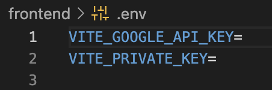

# Wine To Chain

Welcome to Wine To Chain! This guide will walk you through how to use this dApp built on the Arbitrum Sepolia network. To help wine audits and help manage and showcase a transparent supply chain.

### Prerequisites

- Git
- Node.js and npm
- MetaMask wallet (with Arbitrum Sepolia network added)
- Google Cloud account with Google Places API enabled

### Getting Started

1. After using "git pull" and downloading the repo within your chosen code editor. Please direct yourself to the "frontend" folder within the "Szymon" directory. Once there "npm install" to install the dependencies needed for the frontend.

2. Then please create a file within the "frontend" folder called .env, then create two variables called "VITE_GOOGLE_API_KEY" and "VITE_PRIVATE_KEY". For the Google API please head to this website: [Google Cloud Free Trial](https://cloud.google.com/free/docs/free-cloud-features), where you can get yourself a free trial of up to 90 days to use Google's cloud services. Please remember to enable the "Google Places" from the API Menu.

For your private key, please use a burner account. However, go to Metamask account settings to see your PK.

3. Once in the "frontend" folder please just "npm run dev" to start the local frontend server. Also make sure that you're in the account that represents your private key you inputted in the .env file with the addition of the Arbitrum Sepolia Network.

### Page Details

HomePage: Welcome page with a brief description of the dApp.
Wineries: This page allows the user to create a Winery with the location. It will also list the users created Wineries.

Batches: This page is available through the winery page. This is where the user can create different batches of wine like Rose, or Shiraz etc. This is also where the IoT devices in the wine fields will be sending their data into. Once a specific batch of wine is ready the harvest, there is also a Remove Batch button which will ready the data on to the next stage of the supply chain.

ViewStatistics: This page is aviable through the batches pages. Users can view the different data that was being sent and organised in Charts.

Map: This page displays all the wineries the user created into the world, through a Google map markers, and once clicked it will tell you about the batches at a specific winery.

Traceability: On this page you select the batch of wine you wish to trace. So on the batches page, we had Shiraz ready to harvest so we removed it from the IoT data. This step is needed to process to the Traceability stage as otherwise the smart contract logic won't allow it. So we select the batch we want to trace and move on onto the different stages of the wine supply chain like the Tanks, Barrel and Bottle stages. With each container apart from the bottle awaiting a unique ID from the winery manager.

QR Code: Once the batches of wine have reached the last stage of the bottle. The Wine manager can use this page to print the QR code, which tracks the whole supply chain and displays important details back to the wine customer. Like the Winery Name, batch name, wind speed, temperature throughout the harvest etc.

View Details: This page is to show which details will be reflected per batch of wine, and is the webpage the wine customers will be redirected to once the QR code on the bottle is scanned.

### Technology Used

React + Vite, CSS, Javascript, Node, The Graph(GraphQL), Solidity, Ethers.Js, Charts.Js

Network: Arbitrum Sepolia:
WineryManagementContract: 0x69CD17A38FDfBe7779890ca73025eF847dc20A0e
BatchManagementContract1: 0xE954D7fFA466bA88B0B0aa50763DcA47F3164809
WineTraceabilityContract 0x4aD4770fA39E7EeB4c526BfC9F2adBB5ddcE13B1

### Developer Notes

The Google Marker pop up doesnt allow for custom components such as Link inside it. When creating another version remember to try create your own pop up componeonet instead of relying on the Google one.

Found blockchains whcich have subsecond block time like Arbitrum to be the most UX friendly when using subgraph to loading data. However the graph is of of the slower ones, making up for abstraction.
